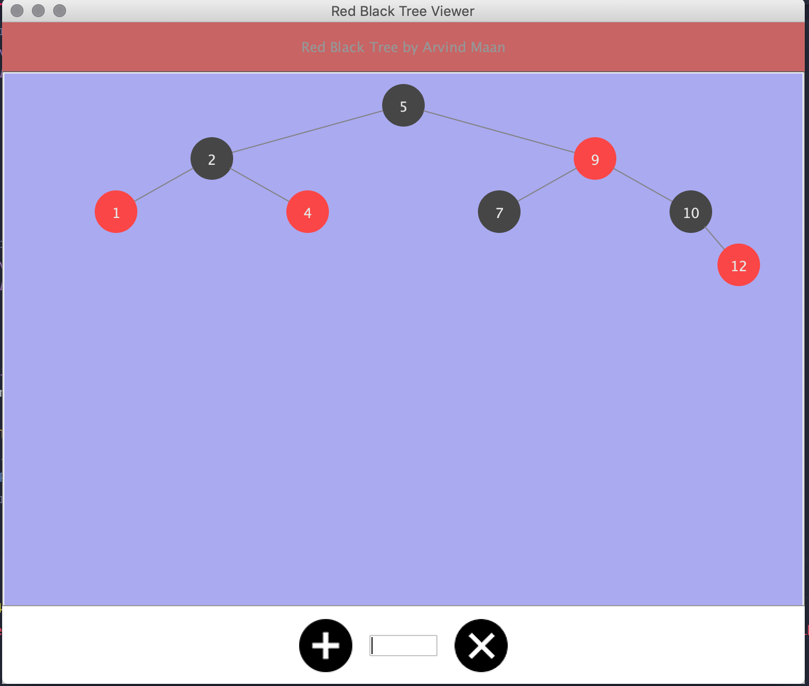

# RedBlackTree
A Red Black Tree written in Java and visually represented using a GUI.

Above is an image of how the GUI looks with some nodes inserted.
The purpose of this project was to better my understanding of the way RB Tree's handled insertion and when to do 
their certain cases. After programming the tree and getting my use out of it, I figured I would create a GUI for the tree and complete the project.
Since I had not previously worked with Java GUI's I had a frustrating time, but eventually, after following the steps of people who created Binary Tree's, I adapted my own version.
